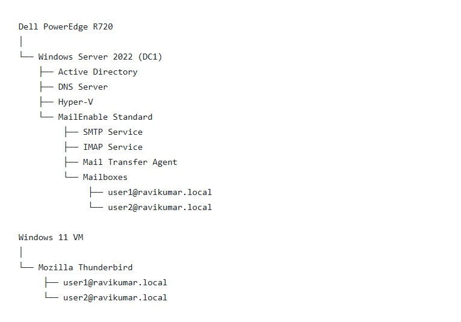
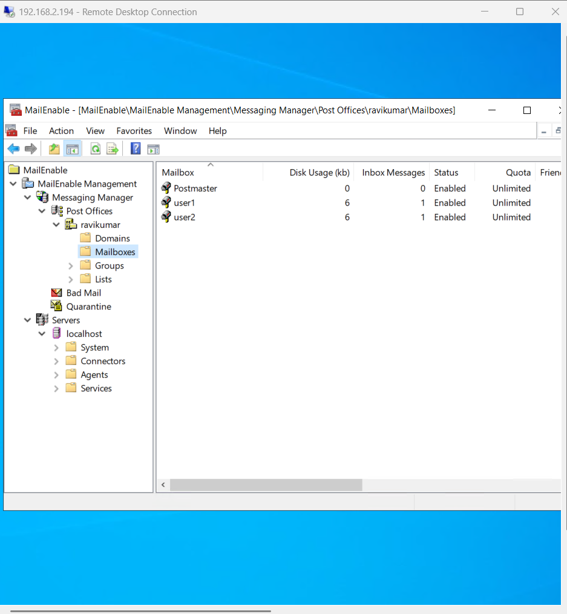
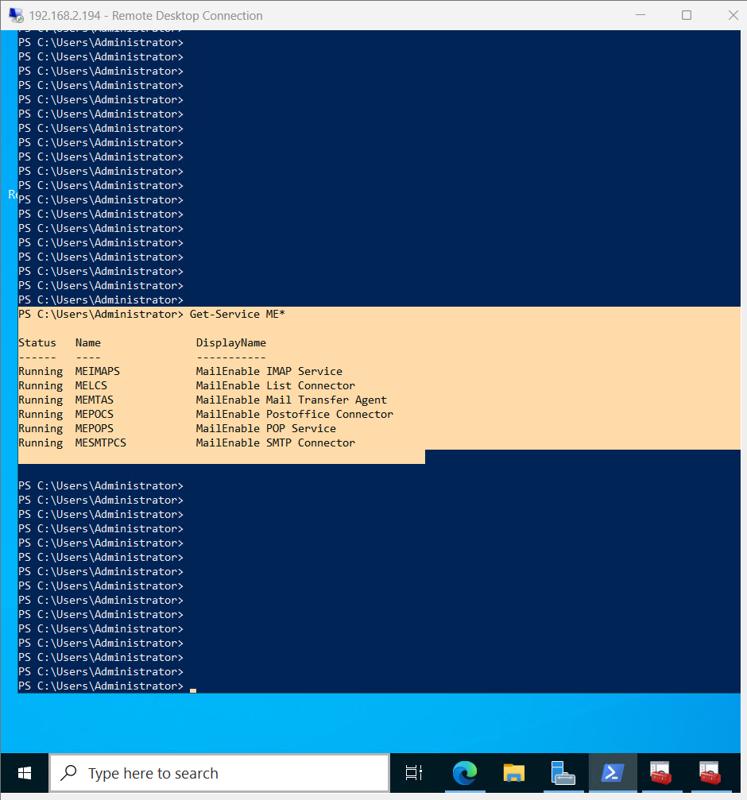
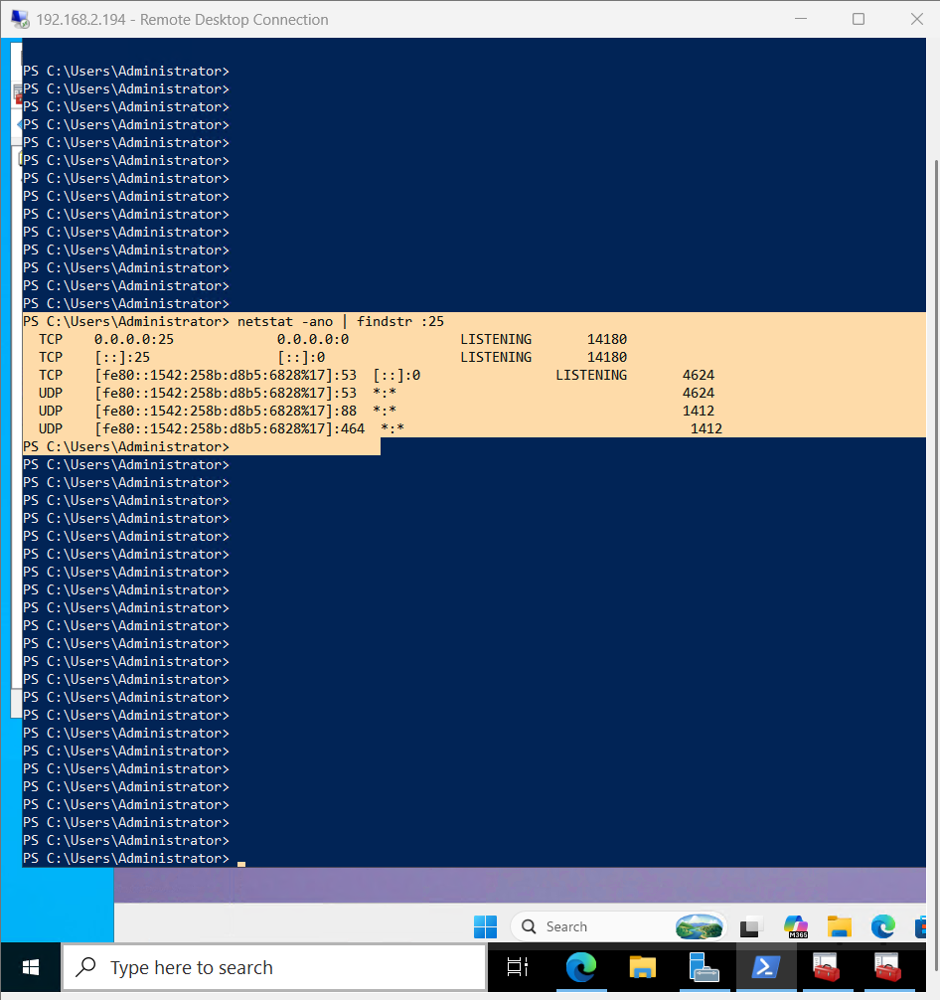
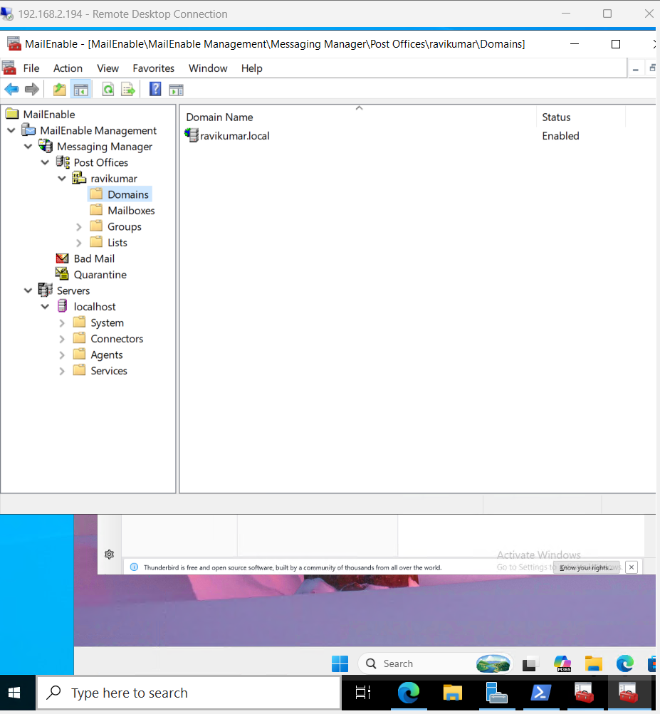
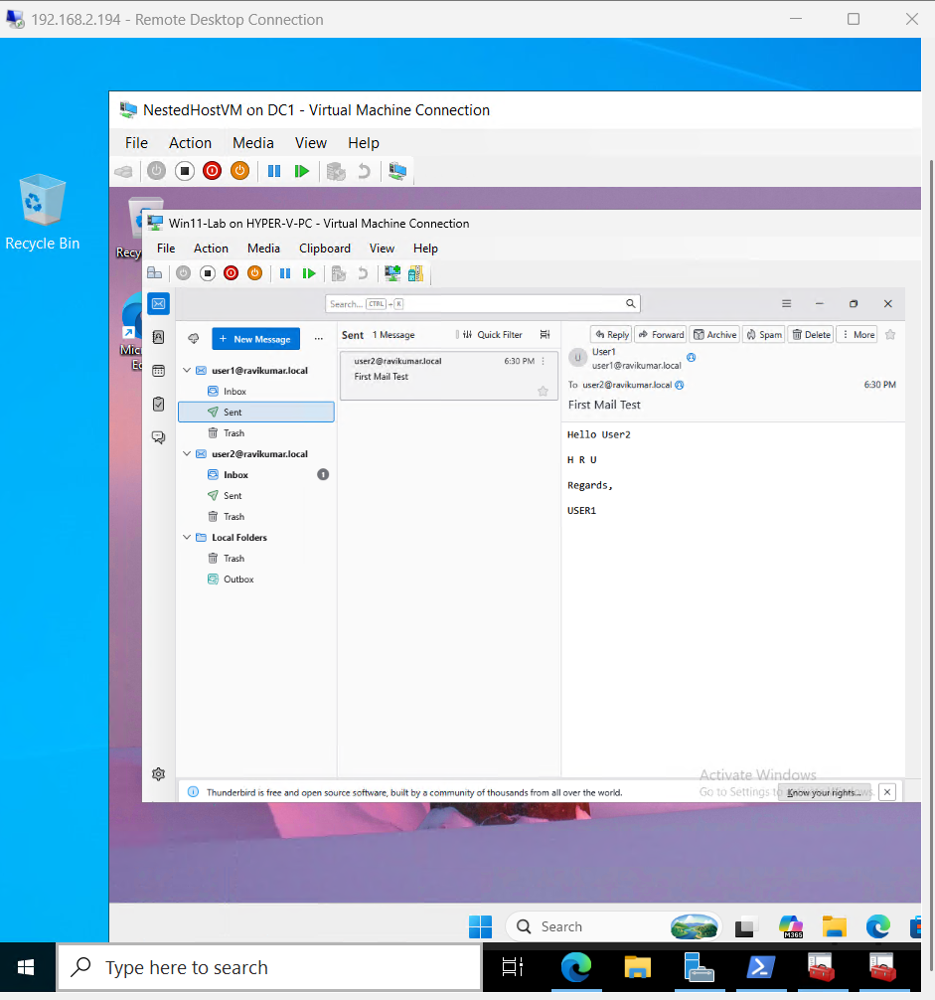
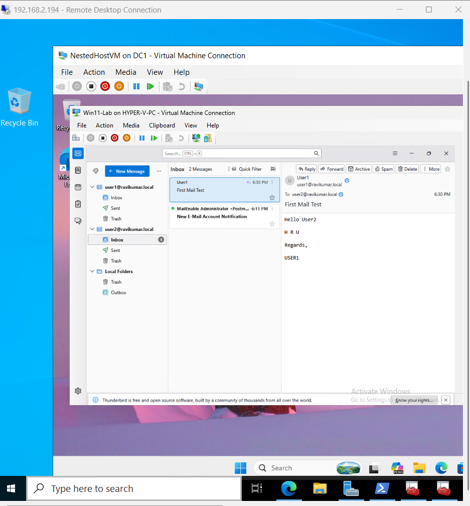

## Windows Server 2022 Mail Server Lab with MailEnable

## Project Overview

This project demonstrates the deployment and configuration of a fully functional mail server environment using Windows Server 2022 and MailEnable Standard Edition. The lab simulates an enterprise email infrastructure by providing SMTP and IMAP services, mailbox management, and end-to-end email communication between users.

The objective of this project was to gain hands-on experience with email server administration, mailbox management, mail routing, and troubleshooting in a Windows Server environment.

## Lab Environment

- Hardware - Dell PowerEdge R720 Server

- Server Platform - Windows Server 2022 Standard

- MailEnable - Standard Edition

- Client Platform - Windows 11 Virtual Machine

- Mozilla Thunderbird - Email Client

## Lab Architecture

## Project Objectives

- Deploy a Windows-based mail server.

- Configure SMTP and IMAP services.

- Create and manage user mailboxes.

- Configure email clients.

- Test email delivery between users.

- Troubleshoot mail routing and connectivity issues.

- Configuration Tasks Performed

- Installation MailEnable Standard Edition on Windows Server 2022.

- Configure a Post Office named: - ravikumar

- Configure the mail domain: - ravikumar.local

## Mailbox Configuration

Created the following mailboxes:

## Mailbox	Email Address

| User | Mailbox Email Address |
|------|-----------------------|
| User1 | `user1@ravikumar.local` |
| User2 | `user2@ravikumar.local` |

User1	user1@ravikumar.local

User2	user2@ravikumar.local

## Email Services Configured

- SMTP Connector

- IMAP Service

- Mail Transfer Agent (MTA)

- Post Office Connector

- POP Service

## Thunderbird Configuration

- User1 Account

Email Address: user1@ravikumar.local

Incoming Server: 192.168.2.194

Protocol: IMAP

Port: 143

Outgoing Server: 192.168.2.194

Protocol: SMTP

Port: 25

- User2 Account

Email Address: user2@ravikumar.local

Incoming Server: 192.168.2.194

Protocol: IMAP

Port: 143

Outgoing Server: 192.168.2.194

Protocol: SMTP

Port: 25

## Testing Performed

Test 1 – User1 to User2

User1 sent an email:

To: user2@ravikumar.local

Subject: First Mail Test

## Result:

SUCCESS

Email delivered to User2 Inbox.

Test 2 – User2 Reply to User1

User2 replied to the email.

## Result:

SUCCESS

Reply successfully received in User1 Inbox.

## Verification

Verified the following:

- MailEnable services running

- SMTP port 25 listening

- IMAP port 143 accessible

- Mailbox creation successful

- Email delivery successful

- Email reply successful

- End-to-end communication verified

## Skills Demonstrated

- Windows Server 2022 Administration

- MailEnable Administration

- SMTP Configuration

- IMAP Configuration

- Email Server Management

- Mailbox Administration

- Network Troubleshooting

- Thunderbird Configuration

- Infrastructure Support

- System Administration

## Testing

User1 Sending Email

User2 Receiving Email

User2 Replying

User1 Receiving Reply

## Project Outcome

Successfully deployed and configured a fully functional enterprise-style mail server using MailEnable on Windows Server 2022. Created multiple mailboxes, configured SMTP and IMAP services, and validated end-to-end email communication between users using Mozilla Thunderbird.
